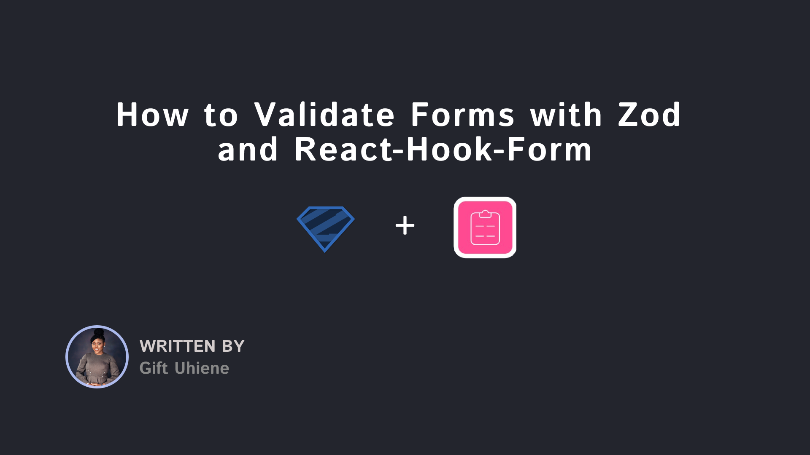

<div id="top"></div>

<br />
<div align="center">
 <a href="https://www.freecodecamp.org/">
   
 </a>


<h3 align="center">How to Validate Forms with Zod and React-Hook-Form</h3>


 <p align="center">
   <br />
   <a href="https://react-fcc-forms.vercel.app/">Live Project</a>
   ·
   <a href="https://www.freecodecamp.org/news/react-form-validation-zod-react-hook-form/">Read Article</a>

 </p>

</div>





## Introduction


This is the GitHub repository for the
[How to Validate Forms with Zod and React-Hook-Form](https://www.freecodecamp.org/news/react-form-validation-zod-react-hook-form/)
tutorial. 

In this tutorial, you will learn how to build a type-safe form using [React-Hook-Form](https://github.com/react-hook-form/react-hook-form) for form management and [Zod](https://github.com/colinhacks/zod) for both client-side and server-side validation.


## Getting Started


To get started, follow the steps below:


1. Clone the `starter` branch of this repository:


```bash
git clone --branch starter https://github.com/Giftea/zod-rhf-fcc.git
```


2. Run the command below to install dependencies:


```bash
npm install
```


3. Start the development server:


```bash
npm run dev
```

All set!

